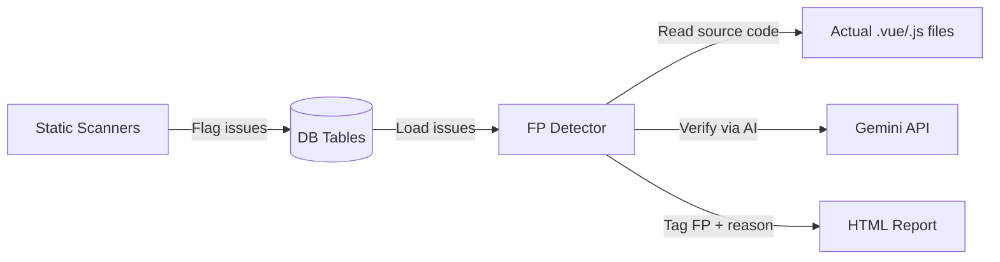

# 🔧 Dynamic False Positive Detection — Full Implementation Plan

## Problem Statement

Your scanners use **static hardcoded rules** (thresholds, substring matches, keyword lists) that produce **incorrect data in the DB**. The issues are flagged as FAIL even when the code is correct. You want to:

1. **Keep all issues visible** in the report (don't hide them)
2. **Tag false positives** with a `⚠ False Positive` badge
3. **Give a description** explaining why it's a false positive
4. **Make detection dynamic** — use actual source code context + AI to verify, not hardcoded patterns

---

## Architecture Overview



**Current flow:** Scanner → hardcoded threshold → always FAIL → DB → report
**New flow:** Scanner → flag issue → FP Detector reads source code → verifies dynamically → tags FP with reason → report

---

## 📋 All Static Flags to Fix (7 Files)

### Summary Table

| # | File | Static Problem | Fix Strategy |
|---|---|---|---|
| 1 | `spell_checker.py` | Flags acronyms/camelCase/tech terms as misspelled | Add tech-term whitelist + AI verification for ambiguous words |
| 2 | `accessibility_checker.py` | `@media` check ignores Tailwind | Read source; if Tailwind classes (`sm:`, `md:`) found → FP |
| 3 | `accessibility_checker.py` | hover/focus on `:hover`/`:disabled` selectors | Parse selector string; if already pseudo-class → FP |
| 4 | `accessibility_checker.py` | `overflow:hidden` on transition classes | Check selector name; if Vue transition class → FP |
| 5 | `accessibility_checker.py` | Button hover/focus check misses global CSS | Check if global/external CSS defines the style |
| 6 | `file_flag_scanner.py` | Hardcoded LOC/API thresholds (3, 5, 8, 500, etc.) | Comment out static thresholds; let LLM scanner handle |
| 7 | `component_complexity_scanner.py` | Hardcoded thresholds (800, 500, 15, 10, 5) | Comment out static flags; keep raw metrics only |
| 8 | `ui_consistency_rules.py` | Header Presence on non-page components | Check file path; skip Sidebar/Footer/Modal/Widget |
| 9 | `ui_consistency_rules.py` | Button Alignment on Flexbox/Grid parents | FP when parent handles alignment |
| 10 | `rag_audit_report.py` | Current FP detection is hardcoded pattern matching | Replace with dynamic source-code + AI verification |

---

## Phase 1: Dynamic FP Detector in `rag_audit_report.py`

> Replace the current hardcoded `detect_false_positive()` with one that **reads the actual source code** and uses **Gemini to verify**.

### File: [rag_audit_report.py](file:///c:/Users/shivanid/Desktop/folder%20analysyis/scanners/rag_audit_report.py)

#### What to change:

```diff
-def detect_false_positive(issue, issue_type):
-    """Returns (is_fp: bool, fp_reason: str). Detects known false positive patterns."""
-    # ... hardcoded pattern matching ...
+def detect_false_positive(issue, issue_type):
+    """
+    DYNAMIC false positive detection.
+    1. Reads the actual source file
+    2. Checks context (Tailwind, CSS framework, parent containers)
+    3. For ambiguous cases, asks Gemini to verify
+    Returns (is_fp: bool, fp_reason: str)
+    """
```

#### New logic inside:

**Step 1 — Read the source file dynamically:**
```python
file_path = issue.get('file_path', '')
source = read_source(file_path) if file_path else None
```

**Step 2 — Context checks (no AI needed):**
```python
# Check if file uses Tailwind CSS
def _uses_tailwind(source):
    """Detect Tailwind by looking for utility class patterns in source."""
    TAILWIND_MARKERS = ['sm:', 'md:', 'lg:', 'xl:', 'flex', 'grid', 'p-', 'm-',
                        'text-sm', 'text-lg', 'bg-', 'rounded', 'shadow']
    if source is None:
        return False
    return sum(1 for m in TAILWIND_MARKERS if m in source) >= 3
```

**Step 3 — AI verification for ambiguous cases:**
```python
def _ask_gemini_fp_check(issue, source_snippet):
    """Ask Gemini: is this issue a real problem or false positive?"""
    prompt = f"""You are a code auditor. A static scanner flagged this issue:

Rule: {issue.get('rule_name')}
Finding: {issue.get('actual_result')}
Severity: {issue.get('severity')}

Source code context:
```
{source_snippet[:3000]}
```

Is this a FALSE POSITIVE? Answer in JSON:
{{"is_false_positive": true/false, "reason": "explanation"}}
"""
    resp = ask_gemini(prompt)
    # parse JSON response...
```

---

## Phase 2: Fix `spell_checker.py` — Stop Flagging Tech Terms

### File: [spell_checker.py](file:///c:/Users/shivanid/Desktop/folder%20analysyis/scanners/spell_checker.py)

#### Current problem (line 132):
```python
raw_misspelled = spell.unknown(words_to_check)
# This flags CDN, PRN, BL, multipart, validator, etc.
```

#### What to change:

```diff
 # Add at top of file, after spell = SpellChecker()
+
+# Technical terms that should never be flagged as misspelled
+TECH_WHITELIST = {
+    # Acronyms
+    'cdn', 'bl', 'prn', 'api', 'url', 'ui', 'ux', 'html', 'css', 'js', 'ts',
+    'http', 'https', 'cors', 'jwt', 'pdf', 'xlsx', 'csv', 'xml', 'sql', 'db',
+    'uuid', 'guid', 'dom', 'sdk', 'npm', 'ajax', 'rest', 'orm', 'auth',
+    # Tech terms
+    'multipart', 'validator', 'middleware', 'webpack', 'vite', 'eslint',
+    'tailwind', 'vuex', 'pinia', 'axios', 'mongodb', 'redis', 'postgres',
+    'navbar', 'sidebar', 'dropdown', 'tooltip', 'checkbox', 'textarea',
+    'formkit', 'localhost', 'backend', 'frontend', 'fullstack', 'signup',
+    'login', 'logout', 'username', 'timestamp', 'boolean', 'async', 'await',
+}
```

```diff
 def correct_text(text: str) -> list:
     words = _extract_alpha_words(text)
     words_to_check = [w.lower() for w in words if len(w) > 1]
     original_case = {w.lower(): w for w in words if len(w) > 1}
 
     raw_misspelled = spell.unknown(words_to_check)
 
     misspelled = [
         w for w in raw_misspelled
         if w not in VALID_LANG_KEYS
+        and w not in TECH_WHITELIST
+        and not (w.upper() == original_case.get(w, w) and len(w) <= 6)  # Skip ALL-CAPS acronyms ≤6 chars
         and not _is_connected_word(original_case.get(w, w))
     ]
```

> [!IMPORTANT]
> This fixes the root cause — stop producing bad data at scan time, not just at report time.

---

## Phase 3: Fix `accessibility_checker.py` — Dynamic Source Checks

### File: [accessibility_checker.py](file:///c:/Users/shivanid/Desktop/folder%20analysyis/scanners/accessibility_checker.py)

#### Change 1: `check_responsive()` — Detect Tailwind before flagging `@media` (line 764)

```diff
 def check_responsive(template, style, file_path, screen):
     issues = []
+
+    # Dynamically detect Tailwind CSS — don't flag @media if Tailwind handles it
+    _is_tailwind = False
+    try:
+        with open(file_path, 'r', encoding='utf-8', errors='ignore') as f:
+            full_source = f.read()
+        TAILWIND_MARKERS = ['sm:', 'md:', 'lg:', 'xl:', 'bg-', 'text-sm', 'flex ', 'grid ', 'p-', 'm-']
+        _is_tailwind = sum(1 for m in TAILWIND_MARKERS if m in full_source) >= 3
+    except Exception:
+        pass
 
     # ... existing rules ...
 
     # Rule 3: No @media queries
-    if style.strip() and '@media' not in style.lower():
+    if style.strip() and '@media' not in style.lower() and not _is_tailwind:
         issues.append({...})
```

#### Change 2: `check_color_contrast()` — Skip hover/focus on pseudo-selectors (line 252)

```diff
     # Rule 5: Buttons — check hover/focus states in CSS
     btn_selectors = set()
     for block in parse_css_blocks(style):
         sel = block['selector'].strip().lower()
-        if 'button' in sel or 'btn' in sel:
+        # Skip selectors that are already pseudo-classes
+        if ('button' in sel or 'btn' in sel) and ':hover' not in sel and ':disabled' not in sel and ':focus' not in sel:
             btn_selectors.add(sel)
```

#### Change 3: `check_responsive()` — Skip `overflow:hidden` on transition classes (line 722)

```diff
         # Rule 2: overflow: hidden
         overflow_val = get_css_property(body, 'overflow').lower()
-        if overflow_val == 'hidden':
+        # Skip Vue transition/animation selectors — overflow:hidden is intentional there
+        TRANSITION_KEYWORDS = ['collapse', 'fade', 'slide', 'transition', 'enter', 'leave', 'animation']
+        sel_lower = selector.lower()
+        is_transition = any(kw in sel_lower for kw in TRANSITION_KEYWORDS)
+        if overflow_val == 'hidden' and not is_transition:
             issues.append({...})
```

---

## Phase 4: Comment Out Static Flags in `file_flag_scanner.py`

### File: [file_flag_scanner.py](file:///c:/Users/shivanid/Desktop/folder%20analysyis/scanners/file_flag_scanner.py)

> [!WARNING]
> These hardcoded thresholds generate incorrect DB data. The LLM scanner (`llm_scanner.py`) already does deeper analysis. Comment out the static flags and let the AI handle it.

#### Comment out these sections:

**API FLAGS (lines 85-109)** — hardcoded thresholds 3/5/8:
```diff
     # ═══════════════════════════════════════════
     # API FLAGS
     # ═══════════════════════════════════════════
-    if api_count >= 3 and api_count < 5:
-        flags["api"].append("HIGH_API_USAGE")
-    elif api_count >= 5 and api_count < 8:
-        flags["api"].append("VERY_HIGH_API_USAGE")
-    elif api_count >= 8:
-        flags["api"].append("EXCESSIVE_API_USAGE")
+    # COMMENTED OUT: Static thresholds produce false positives.
+    # LLM scanner (llm_scanner.py) analyses code context dynamically.
+    # if api_count >= 3 and api_count < 5:
+    #     flags["api"].append("HIGH_API_USAGE")
+    # elif api_count >= 5 and api_count < 8:
+    #     flags["api"].append("VERY_HIGH_API_USAGE")
+    # elif api_count >= 8:
+    #     flags["api"].append("EXCESSIVE_API_USAGE")
```

**COMPLEXITY FLAGS (lines 149-158)** — hardcoded LOC 500, methods 15, etc.:
```diff
     # ═══════════════════════════════════════════
     # COMPLEXITY FLAGS
     # ═══════════════════════════════════════════
-    if loc > 500:
-        flags["complexity"].append("LARGE_COMPONENT")
+    # COMMENTED OUT: Static LOC threshold is misleading.
+    # A 600-line file with good structure is fine; a 200-line file with bad logic is worse.
+    # if loc > 500:
+    #     flags["complexity"].append("LARGE_COMPONENT")
 
-    if script_ast:
-        if count_properties_in_object_key(script_ast, 'methods') > 15:
-            flags["complexity"].append("MANY_METHODS")
-        if count_properties_in_object_key(script_ast, 'computed') > 10:
-            flags["complexity"].append("MANY_COMPUTED")
-        if count_properties_in_object_key(script_ast, 'watch') > 5:
-            flags["complexity"].append("MANY_WATCHERS")
+    # COMMENTED OUT: Method/computed/watcher counts without context are misleading.
+    # if script_ast:
+    #     if count_properties_in_object_key(script_ast, 'methods') > 15:
+    #         flags["complexity"].append("MANY_METHODS")
+    #     if count_properties_in_object_key(script_ast, 'computed') > 10:
+    #         flags["complexity"].append("MANY_COMPUTED")
+    #     if count_properties_in_object_key(script_ast, 'watch') > 5:
+    #         flags["complexity"].append("MANY_WATCHERS")
```

**RISK FLAGS (lines 214-239)** — these depend on the above flags:
```diff
     # ═══════════════════════════════════════════
     # RISK FLAGS
     # ═══════════════════════════════════════════
-    api_flags = flags["api"]
-    ... all risk flag logic ...
-    if flags["api"] and flags["payload"] and flags["complexity"]:
-        flags["risk"].append("ARCHITECTURE_CONCERN")
+    # COMMENTED OUT: Risk flags are derived from the static flags above.
+    # Since those are now disabled, risk flags would be empty anyway.
+    # The LLM scanner provides context-aware risk analysis instead.
```

**Keep these (they use AST, not thresholds):**
- ✅ PAYLOAD FLAGS — actual AST-based key counting (lines 114–144)
- ✅ PATTERN FLAGS — actual AST-based loop/chaining detection (lines 160–192)
- ✅ UI FLAGS — template tag counting (lines 196–212)

---

## Phase 5: Comment Out Static Flags in `component_complexity_scanner.py`

### File: [component_complexity_scanner.py](file:///c:/Users/shivanid/Desktop/folder%20analysyis/scanners/component_complexity_scanner.py)

> Keep the **raw metrics** (totallines, methods, computed, etc.) — they're useful data. Only comment out the **static threshold flags**.

```diff
     # ── Flags ─────────────────────────────────
-    flags = []
-    if totallines > 800:
-        flags.append("VERY_LARGE_COMPONENT")
-    elif totallines > 500:
-        flags.append("LARGE_COMPONENT")
-    if methods > 15:
-        flags.append("MANY_METHODS")
-    if computed > 10:
-        flags.append("MANY_COMPUTED")
-    if watchers > 5:
-        flags.append("MANY_WATCHERS")
-    if template_lines > 200:
-        flags.append("COMPLEX_TEMPLATE")
-    if child_components > 5:
-        flags.append("MANY_CHILDREN")
+    # COMMENTED OUT: Static threshold flags generate false positives.
+    # The raw metrics (totallines, methods, etc.) are still saved to DB
+    # for the report. The LLM scanner analyses actual code quality.
+    flags = []
+    # if totallines > 800:
+    #     flags.append("VERY_LARGE_COMPONENT")
+    # elif totallines > 500:
+    #     flags.append("LARGE_COMPONENT")
+    # if methods > 15:
+    #     flags.append("MANY_METHODS")
+    # if computed > 10:
+    #     flags.append("MANY_COMPUTED")
+    # if watchers > 5:
+    #     flags.append("MANY_WATCHERS")
+    # if template_lines > 200:
+    #     flags.append("COMPLEX_TEMPLATE")
+    # if child_components > 5:
+    #     flags.append("MANY_CHILDREN")
```

---

## Phase 6: Fix `ui_consistency_rules.py` — Smarter Context Rules

### File: [ui_consistency_rules.py](file:///c:/Users/shivanid/Desktop/folder%20analysyis/scanners/ui_consistency_rules.py)

#### Change 1: `check_header_presence()` — Skip non-page components (line 351)

```diff
 def check_header_presence(elements, rule):
     if elements:
         file_path = elements[0].get("file_path", "")
-        if "footer" in file_path.lower():
+        # Skip non-page components — they don't need headers
+        SKIP_KEYWORDS = ('footer', 'sidebar', 'navbar', 'nav', 'modal', 'dialog',
+                         'card', 'widget', 'toast', 'tooltip', 'dropdown', 'menu',
+                         'tab', 'accordion', 'carousel', 'spinner', 'loader',
+                         'icon', 'badge', 'chip', 'avatar', 'progress', 'bar')
+        fname_lower = file_path.lower()
+        if any(kw in fname_lower for kw in SKIP_KEYWORDS):
             return None
```

#### Change 2: `check_button_alignment_class()` — Skip if parent has Flex/Grid (line 441)

```diff
 def check_button_alignment_class(elements, rule):
+    # Read source to check if parent containers use Flexbox/Grid
+    file_path = elements[0].get("file_path", "") if elements else ""
+    parent_handles_alignment = False
+    try:
+        with open(file_path, 'r', encoding='utf-8', errors='ignore') as f:
+            source = f.read()
+        # If file uses Tailwind flex/grid utilities, parent likely handles alignment
+        FLEX_MARKERS = ['flex ', 'justify-', 'items-', 'grid ', 'gap-', 'd-flex', 'justify-content']
+        parent_handles_alignment = any(m in source for m in FLEX_MARKERS)
+    except Exception:
+        pass
+
+    if parent_handles_alignment:
+        return None   # Parent container handles button alignment
+
     ALIGNMENT_KEYWORDS = {"text-right", ...}
```

---

## Phase 7: Update `main.py` Pipeline

### File: [main.py](file:///c:/Users/shivanid/Desktop/folder%20analysyis/main.py)

The pipeline is already correct — `llm_scanner.py` runs at Stage 4 and gives dynamic analysis. The static scanners at Stage 3 provide structure data. With Phases 2–6 above:

- Static scanners still populate the **raw data** (metrics, extractions, APIs)
- Static **threshold flags are commented out** (no more false flag data in DB)
- The **LLM scanner** provides the real quality/risk analysis
- The **FP detector** in `rag_audit_report.py` catches any remaining false positives at report time

No changes needed to `main.py`.

---

## Execution Order

| Step | File to Change | Risk | Time |
|---|---|---|---|
| 1 | `spell_checker.py` — Add `TECH_WHITELIST` | Low | 5 min |
| 2 | `accessibility_checker.py` — Tailwind detection, pseudo-selector fix, transition fix | Medium | 15 min |
| 3 | `file_flag_scanner.py` — Comment out static flags | Low | 5 min |
| 4 | `component_complexity_scanner.py` — Comment out static flags | Low | 5 min |
| 5 | `ui_consistency_rules.py` — Header skip, Flex alignment skip | Medium | 10 min |
| 6 | `rag_audit_report.py` — Dynamic FP detector with source reading | Medium | 15 min |
| 7 | Run full scan + verify report | — | 10 min |

**Total estimated time: ~65 minutes**

---

## What Stays, What Goes

### ✅ KEEP (real data, dynamic analysis)
- File/folder/component scanning → raw structure data
- API scanner → actual AST-parsed API calls
- UI extraction scanner → actual template element extraction
- Code metrics scanner → actual LOC/comment/blank counting
- LLM scanner → Gemini-powered deep analysis
- Payload flags → AST-based key counting
- Pattern flags → AST-based loop/chaining detection

### ❌ COMMENT OUT (static hardcoded thresholds)
- `file_flag_scanner.py` → API count thresholds (3/5/8)
- `file_flag_scanner.py` → LOC threshold (500), method/computed/watcher thresholds
- `file_flag_scanner.py` → Risk flags (derived from above)
- `component_complexity_scanner.py` → All threshold-based flags

### 🔧 FIX AT SOURCE (scanner logic bugs)
- `spell_checker.py` → Add tech whitelist + acronym skip
- `accessibility_checker.py` → Tailwind detection, pseudo-selector fix
- `ui_consistency_rules.py` → Non-page component skip, Flex parent skip

### 🏷️ TAG AT REPORT TIME (remaining edge cases)
- `rag_audit_report.py` → Dynamic FP detector as final safety net
